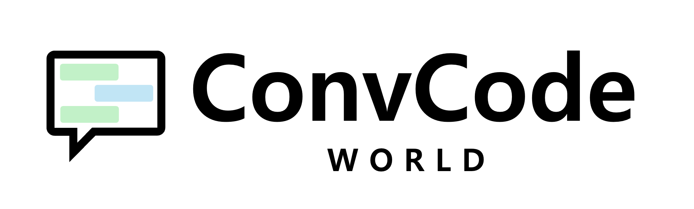
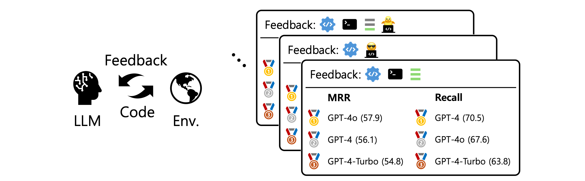
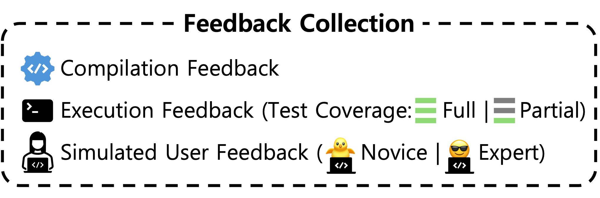
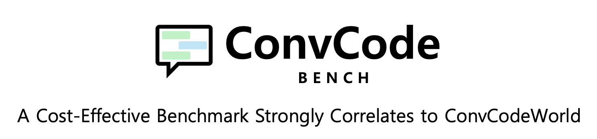
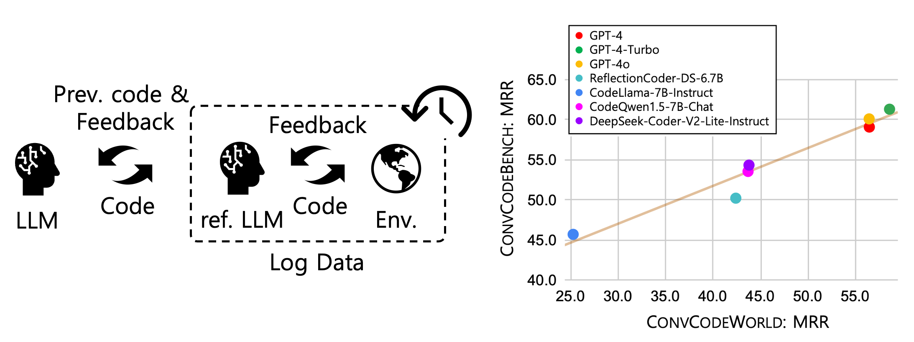

# ConvCodeWorld & ConvCodeBench
<center>

</center>

<p align="center">

[//]: # (    <a href="https://huggingface.co/spaces/bigcode/bigcodebench-leaderboard"></a>)

[//]: # (    <a href="https://arxiv.org/abs/2406.15877"></a>)

[//]: # (    <a href="https://pypi.org/project/bigcodebench/"></a>)
[//]: # (    <a href="https://github.com/bigcodebench/bigcodebench/blob/master/LICENSE"></a>)
</p>

<p align="center">
    <a href="#-about">🎙️About</a> •
    <a href="#-quick-start">🔥Quick Start</a> •
    <a href="#-full-script">🚀Full Script</a> •
    <a href="#-result-analysis">📊Evaluation</a> •
    <a href="#-llm-generated-code">💻LLM-generated Code</a> •
    <a href="#-known-issues">🐞Known Issues</a> •
    <a href="#-citation">📜Citation</a> •
    <a href="#-acknowledgement">🙏Acknowledgement</a>
</p>

## News
- **[2024-09-10]** We release ConvCodeWorld, reproducible environments with diverse feedback combination for conversational code generation, and ConvCodeBench, a cost-effective benchmark strongly correlates to ConvCodeWorld.

[//]: # (Preprint is available [here]&#40;&#41;. PyPI package is available [here]&#40;&#41; with the version `0.3.6`.&#40;&#41;)
## 🎙️ About


<p align="center">

<br>

</p>


ConvCodeWorld provides novel, reproducible environments designed to assess the multi-turn code generation capabilities of LLMs. 
This environment incorporates a comprehensive categorization of feedback types that reflect diverse real-world programming scenarios. 

### Available Feedback Types

<p align="center">

</p>


- **Compilation Feedback** indicates whether the code compiles successfully or provides error messages.
- **Execution Feedback**  assesses the code's runtime behavior, further divided into:
  - **Partial Test Coverage**: practical settings that only a part of test cases is available 
  - **Full Test Coverage**: when annotated test cases manage near complete test coverage (average branch coverage of 99%) including most edge cases
- **Verbal Feedback**: To ensure a controllable & reproducible feedback, we employ GPT-4o to generate verbal feedback, categorized by expertise:
  - **Novice-level Feedback** simulates interactions with novice users who can identify issues but may not know how to fix them.
  - **Expert-level Feedback** represents guidance from experienced programmers who can provide specific suggestions for code improvement. 


---
<p align="center">

<br>

</p>


ConvCodeBench is a cost-effective benchmark that strongly correlates to ConvCodeWorld.
ConvCodeBench uses logs from ConvCodeWorld generated by a reference LLM (CodeLlama-7b-Instruct-hf) alongside corresponding simulated verbal feedback, to assess the target LLMs' ability to refine code at each turn, while keeping the previous interactions frozen. 
ConvCodeBench is more cost-effective, efficient, and reproducible, as it eliminates the need to re-generate verbal feedback at each turn. 

[//]: # (### ConvCodeBench is the Best Suite for...)

[//]: # (- ✨Cost-effective )

[//]: # (- )


## 🔥 Quick Start

To get started, please first set up the environments:

### Install MiniConda
```bash
wget https://repo.anaconda.com/miniconda/Miniconda3-latest-Linux-x86_64.sh
chmod +x Miniconda3-latest-Linux-x86_64.sh
bash Miniconda3-latest-Linux-x86_64.sh -b
export PATH="$HOME/miniconda3/bin:$PATH"
conda init
# For changes to take effect, you need to close and re-open your current shell.
conda install conda-forge::conda-ecosystem-user-package-isolation -y
```

### Setup Conda Environments
All you need to do is run `setup.sh` 😊.
```bash
bash setup.sh
```
This script will create three environments:
- `ConvCodeWorld`: The main environment for ConvCode[World|Bench] 
- `bigcodebench`: [BigCodeBench](https://github.com/bigcode-project/bigcodebench) for initial code generation and code execution
- `vllm`: [vLLM](https://github.com/vllm-project/vllm) to accelerate inference speed of open-source LLMs

### OpenAI API Key 
Please save your API key in `convcodeworld` folder (where `run.py` is placed).
```bash
cd convcodeworld
echo $OPENAI_API_KEY > .api_key
```
This is necessary if 1) you run on ConvCodeWorld, or 2) you want to use OpenAI models for code generation.  

### Run vLLM 
If you want to use open-source models for code generation, you need to run: 
```bash
bash run_vllm.sh $MODEL_NAME
# Now open another kernel and run ConvCode[World|Bench]!  
```
Note that `$MODEL_NAME` is a full huggingface name such as `deepseek-ai/deepseek-coder-6.7b-instruct`. 
The default setting is to use `bfloat16` and to occupy a single GPU.
If you want to use quantization, you can simply include `--quantization="fp8"` in `run_vllm.sh`.
Similarly, if you want to use `n` gpus, you can include: `--tensor-parallel-size n`.


## 🚀 Full Script

### ConvCodeWorld
 To run ConvCodeWorld, we provide a sample script for the full pipeline: 
```bash
bash run_convcodeworld.sh $MODEL_NAME $BACKEND $EXECUTION_FEEDBACK $PARTIAL_TEST $VERBAL_FEEDBACK $EXPERTISE
```
- `MODEL_NAME`: A full model name from huggingface or openai API lists such as `deepseek-ai/deepseek-coder-6.7b-instruct`.
- `BACKEND` (`vllm`, `openai`, or `azure_openai`): A backend setting for `MODEL_NAME`.  
- `EXECUTION_FEEDBACK` (`true` or `false`): `true` if employ execution feedback. 
- `PARTIAL_TEST` (`true`, `false`, or `none`): `true` if only a part of test cases is available. `none` if `EXECUTION_FEEDBACK` is `false`. 
- `VERBAL_FEEDBACK` (`true` or `false`): `true` if employ verbal feedback by GPT-4o. 
- `EXPERTISE` (`novice`, `expert`, or `none`): Expertise for verbal feedback. `none` if `VERBAL_FEEDBACK` is `false`. 

Note that compilation feedback is always included.

#### Example
If you want to run `deepseek-ai/deepseek-coder-6.7b-instruct` while feeding execution feedback with full test cases and novice-level verbal feedback:
```bash
bash run_convcodeworld.sh deepseek-ai/deepseek-coder-6.7b-instruct vllm true false true novice
```
 

### ConvCodeBench
To run ConvCodeBench, we also provide a sample script as follows: 

```bash
bash run_convcodebench.sh $MODEL_NAME $BACKEND $EXECUTION_FEEDBACK $PARTIAL_TEST $VERBAL_FEEDBACK $EXPERTISE $REF_MODEL_NAME
```
- `MODEL_NAME`: A full model name from huggingface or openai API lists such as `deepseek-ai/deepseek-coder-6.7b-instruct`.
- `BACKEND` (`vllm`, `openai`, or `azure_openai`): A backend setting for `MODEL_NAME`.  
- `EXECUTION_FEEDBACK` (`true` or `false`): `true` if employ execution feedback. 
- `PARTIAL_TEST` (`true`, `false`, or `none`): `true` if only a part of test cases is available. `none` if `EXECUTION_FEEDBACK` is `false`. 
- `VERBAL_FEEDBACK` (`true` or `false`): `true` if employ verbal feedback by GPT-4o. 
- `EXPERTISE` (`novice`, `expert`, or `none`): Expertise for verbal feedback. `none` if `VERBAL_FEEDBACK` is `false`. 
- `REF_MODEL_NAME`: The reference model name. We recommend `codellama/CodeLlama-7b-Instruct-hf`.  

#### Example
If you want to run `gpt-4-0613` while feeding expert-level verbal feedback:
```bash
bash run_convcodeworld.sh gpt-4-0613 openai false false true expert codellama/CodeLlama-7b-Instruct-hf
```


## 📊 Evaluation

We provide a script to replicate the MRR and Recall results.

### ConvCodeWorld
To print the ConvCodeWorld results: 
```bash
python print_results.py --option live --model_name $MODEL_NAME --save_dir $SAVE_DIR
```
- `MODEL_NAME`: A full huggingface name such as `deepseek-ai/deepseek-coder-6.7b-instruct`.  
- `SAVE_DIR`: A directory path where the results are stored. Default is `results`.


#### Evaluation Example
```
$ python print_results.py --option live --model_name deepseek-ai/deepseek-coder-6.7b-instruct
+------+-------+-----------------------+--------------------+-----------+---------------------------+------------------------+-----------+---------------------------+------------------------+
| Turn | w/ CF | w/ CF EF (partial TC) | w/ CF EF (full TC) | w/ CF SNF | w/ CF EF (partial TC) SNF | w/ CF EF (full TC) SNF | w/ CF SEF | w/ CF EF (partial TC) SEF | w/ CF EF (full TC) SEF |
+------+-------+-----------------------+--------------------+-----------+---------------------------+------------------------+-----------+---------------------------+------------------------+
|  0   |  35.2 |          35.2         |        35.2        |    35.2   |            35.2           |          35.2          |    35.2   |            35.2           |          35.2          |
|  1   |  35.2 |          36.9         |        36.5        |    35.2   |            41.1           |          42.8          |    60.0   |            60.0           |          61.8          |
|  2   |  35.2 |          37.0         |        36.8        |    35.2   |            42.4           |          45.7          |    68.4   |            69.0           |          70.8          |
|  3   |  35.2 |          37.2         |        37.1        |    35.2   |            42.8           |          46.8          |    74.4   |            73.8           |          76.0          |
|  4   |  35.2 |          37.4         |        37.1        |    35.2   |            42.9           |          46.9          |    77.5   |            77.2           |          78.3          |
|  5   |  35.2 |          37.4         |        37.1        |    35.2   |            42.9           |          47.6          |    79.0   |            79.0           |          79.9          |
|  6   |  35.2 |          37.5         |        37.3        |    35.2   |            42.8           |          47.6          |    80.7   |            80.3           |          80.8          |
|  7   |  35.2 |          37.5         |        37.3        |    35.2   |            43.0           |          47.7          |    81.7   |            80.7           |          81.6          |
|  8   |  35.2 |          37.4         |        37.1        |    35.2   |            42.8           |          47.8          |    82.2   |            81.2           |          82.1          |
|  9   |  35.2 |          37.4         |        37.2        |    35.2   |            42.9           |          47.6          |    82.5   |            81.7           |          82.3          |
|  10  |  35.2 |          37.4         |        37.1        |    35.2   |            42.9           |          47.7          |    82.7   |            82.3           |          83.0          |
+------+-------+-----------------------+--------------------+-----------+---------------------------+------------------------+-----------+---------------------------+------------------------+
Table 1. Pass@1 results of deepseek-ai/deepseek-coder-6.7b-instruct on ConvCodeWorld for each turn.
 - CF: Compilation Feedback
 - EF: Execution Feedback
 - partial|full TC: test cases with partial|full Test Coverage 
 - SNF: Simulated Novice Feedback
 - SEF: Simulated Expert Feedback

+---------+-------+-----------------------+--------------------+-----------+---------------------------+------------------------+-----------+---------------------------+------------------------+
| Metrics | w/ CF | w/ CF EF (partial TC) | w/ CF EF (full TC) | w/ CF SNF | w/ CF EF (partial TC) SNF | w/ CF EF (full TC) SNF | w/ CF SEF | w/ CF EF (partial TC) SEF | w/ CF EF (full TC) SEF |
+---------+-------+-----------------------+--------------------+-----------+---------------------------+------------------------+-----------+---------------------------+------------------------+
|   MRR   |  35.2 |          36.2         |        36.1        |    35.2   |            38.8           |          40.5          |    53.3   |            53.2           |          53.9          |
|  Recall |  35.2 |          37.7         |        37.5        |    35.2   |            43.3           |          48.2          |    82.8   |            82.5           |          83.1          |
+---------+-------+-----------------------+--------------------+-----------+---------------------------+------------------------+-----------+---------------------------+------------------------+
Table 2. MRR and Recall results of deepseek-ai/deepseek-coder-6.7b-instruct on ConvCodeWorld.
```

### ConvCodeBench
To print the ConvCodeBench results: 
```bash
python print_results.py --option static --model_name $MODEL_NAME --ref_model_name $REF_MODEL_NAME --save_dir $SAVE_DIR
```
- `MODEL_NAME`: A full huggingface name such as `SenseLLM/ReflectionCoder-DS-33B`.  
- `REF_MODEL_NAME`: A full huggingface name of the reference model such as `codellama/CodeLlama-7b-Instruct-hf`.  
- `SAVE_DIR`: A directory path where the results are stored. Default is `results`.

#### Evaluation Example
```
$ python print_results.py --option static --model_name SenseLLM/ReflectionCoder-DS-33B --ref_model_name codellama/CodeLlama-7b-Instruct-hf
+------+---------------------------+------------------------+-----------+---------------------------+------------------------+
| Turn | w/ CF EF (partial TC) SNF | w/ CF EF (full TC) SNF | w/ CF SEF | w/ CF EF (partial TC) SEF | w/ CF EF (full TC) SEF |
+------+---------------------------+------------------------+-----------+---------------------------+------------------------+
|  1   |            31.0           |          35.5          |    56.8   |            57.9           |          58.1          |
|  2   |            29.9           |          34.5          |    56.2   |            55.4           |          56.0          |
|  3   |            29.8           |          34.7          |    59.5   |            58.4           |          57.7          |
|  4   |            29.5           |          35.2          |    61.8   |            59.7           |          59.8          |
|  5   |            29.2           |          35.8          |    63.7   |            59.8           |          60.4          |
|  6   |            29.2           |          36.1          |    65.5   |            60.7           |          60.9          |
|  7   |            29.2           |          36.0          |    65.2   |            61.3           |          61.0          |
|  8   |            29.4           |          35.6          |    67.0   |            61.1           |          61.1          |
|  9   |            29.2           |          36.5          |    67.5   |            61.7           |          61.6          |
|  10  |            29.3           |          35.9          |    67.5   |            61.7           |          61.0          |
+------+---------------------------+------------------------+-----------+---------------------------+------------------------+
Table 1. Pass@1 results of SenseLLM/ReflectionCoder-DS-33B on ConvCodeBench for each turn (ref. model: codellama/CodeLlama-7b-Instruct-hf).
 - CF: Compilation Feedback
 - EF: Execution Feedback
 - partial|full TC: test cases with partial|full Test Coverage 
 - SNF: Simulated Novice Feedback
 - SEF: Simulated Expert Feedback

+---------+---------------------------+------------------------+-----------+---------------------------+------------------------+
| Metrics | w/ CF EF (partial TC) SNF | w/ CF EF (full TC) SNF | w/ CF SEF | w/ CF EF (partial TC) SEF | w/ CF EF (full TC) SEF |
+---------+---------------------------+------------------------+-----------+---------------------------+------------------------+
|   MRR   |            47.9           |          49.9          |    59.5   |            59.1           |          59.6          |
|  Recall |            51.2           |          56.2          |    82.2   |            77.8           |          79.6          |
+---------+---------------------------+------------------------+-----------+---------------------------+------------------------+
Table 2. MRR and Recall results of SenseLLM/ReflectionCoder-DS-33B on ConvCodeBench (ref. model: codellama/CodeLlama-7b-Instruct-hf).
```


## 💻 LLM-generated Code

We will share generated code samples from LLMs we have evaluated.

## 🐞 Known Issues
-  [Due to the flakiness in the evaluation](https://github.com/bigcode-project/bigcodebench?tab=readme-ov-file#-known-issues), the execution results may vary slightly (~0.2% for Full set, and ~0.6% for Hard set) between runs.

## 📜 Citation

```bibtex

```

## 🙏 Acknowledgement

- [BigCodeBench](https://github.com/bigcode-project/bigcodebench)
- [DSPy](https://github.com/stanfordnlp/dspy)
- [vLLM](https://github.com/vllm-project/vllm)