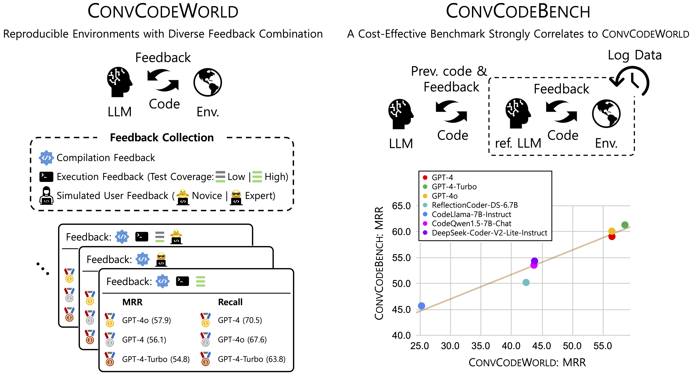

# ConvCodeWorld & ConvCodeBench
<center>

</center>

<p align="center">
    <a href="https://huggingface.co/spaces/bigcode/bigcodebench-leaderboard"></a>
    <a href="https://arxiv.org/abs/2406.15877"></a>
    <a href="https://pypi.org/project/bigcodebench/"></a>
    <a href="https://github.com/bigcodebench/bigcodebench/blob/master/LICENSE"></a>
</p>

<p align="center">
    <a href="#-about">🎙️About</a> •
    <a href="#-quick-start">🔥Quick Start</a> •
    <a href="#-failure-inspection">🔍Failure Inspection</a> •
    <a href="#-full-script">🚀Full Script</a> •
    <a href="#-result-analysis">📊Result Analysis</a> •
    <a href="#-llm-generated-code">💻LLM-generated Code</a> •
    <a href="#-known-issues">🐞Known Issues</a> •
    <a href="#-citation">📜Citation</a> •
    <a href="#-acknowledgement">🙏Acknowledgement</a>
</p>

## News
- **[2024-09-XX]** We release ConvCodeWorld, a new benchmark for code generation with 1140 software-engineering-oriented programming tasks. Preprint is available [here](). PyPI package is available [here]() with the version `0.3.6`.

## 🎙️ About

<center>

</center>

### ConvCodeWorld

ConvCodeWorld is a controllable environment that ...

### Why ConvCodeWorld?

ConvCodeWorld focuses on the evaluation of ...

### ConvCodeBench

ConvCodeBench is a static version of ConvCodeWorld, ...

### Why ConvCodeWorld?

ConvCodeBench is cheaper...


* ✨ **Precise evaluation & ranking**: See [our leaderboard]() for latest LLM rankings before & after rigorous evaluation.
* ✨ **Pre-generated samples**: ConvCodeWorld accelerates code intelligence research by open-sourcing [LLM-generated samples](#-LLM-generated-code) for various models -- no need to re-run the expensive benchmarks!

## 🔥 Quick Start

To get started, please first set up the environment:

### Install MiniConda
```bash
wget https://repo.anaconda.com/miniconda/Miniconda3-latest-Linux-x86_64.sh
chmod +x Miniconda3-latest-Linux-x86_64.sh
bash Miniconda3-latest-Linux-x86_64.sh -b
conda install conda-forge::conda-ecosystem-user-package-isolation
# Restart the kernel
```

### Setup Conda Environments
All you need to do is run `setup.sh` 😊.
```bash
bash setup.sh
```
This script will create three environments:
- `ConvCodeWorld`: The main environment for ConvCode[World|Bench] 
- `bigcodebench`: [BigCodeBench](https://github.com/bigcode-project/bigcodebench) for initial code generation and code execution
- `vllm`: [vLLM](https://github.com/vllm-project/vllm) to accelerate inference speed of open-source LLMs

### OpenAI API Key 
Please save your API key in `convcodeworld` folder (where `run.py` is placed).
```bash
cd convcodeworld
echo $OPENAI_API_KEY > .api_key
```
This is necessary if 1) you run on ConvCodeWorld, or 2) you want to use OpenAI models for code generation.  

### Run vLLM 
If you want to use open-source models for code generation, you need to run: 
```bash
bash run_vllm.sh $MODEL_NAME
# Now open another kernel and run ConvCode[World|Bench]!  
```
Note that `$MODEL_NAME` is a full huggingface name such as `deepseek-ai/deepseek-coder-6.7b-instruct`. 
The default setting is to use `bfloat16` and to occupy a single GPU.
If you want to use quantization, you can simply include `--quantization="fp8"` in `run_vllm.sh`.
Similarly, if you want to use `n` gpus, you can include: `--tensor-parallel-size n`.

## 🔍 Failure Inspection

You can inspect the failed samples by using the following command:

```bash
# Inspect the failed samples and save the results to `inspect/`
bigcodebench.inspect --eval_results sample-sanitized-calibrated_eval_results.json --split complete --subset hard

# Re-run the inspection in place
bigcodebench.inspect --eval_results sample-sanitized-calibrated_eval_results.json --split complete --subset hard --in_place
```

## 🚀 Full Script

We provide a sample script to run the full pipeline:

```bash
bash run.sh
```

## 📊 Result Analysis

We provide a script to replicate the analysis like MRR and C-Recall ...


To run the analysis, you need to ... 

```bash
python print_results.py ...
```


## 💻 LLM-generated Code

We share pre-generated code samples from LLMs we have [evaluated]().

## 🐞 Known Issues


## 📜 Citation

```bibtex

```

## 🙏 Acknowledgement

- [BigCodeBench](https://github.com/bigcode-project/bigcodebench)
- [DSPy](https://github.com/stanfordnlp/dspy)
- [vLLM](https://github.com/vllm-project/vllm)