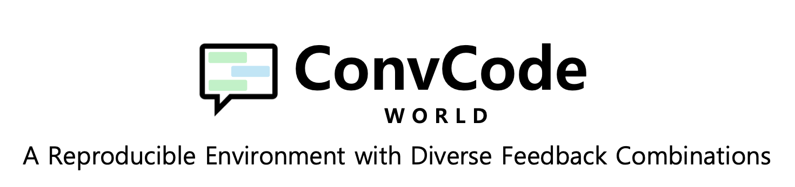
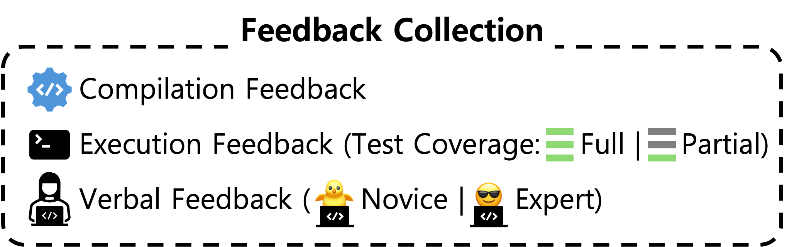
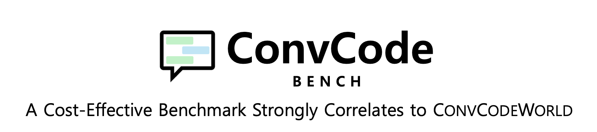
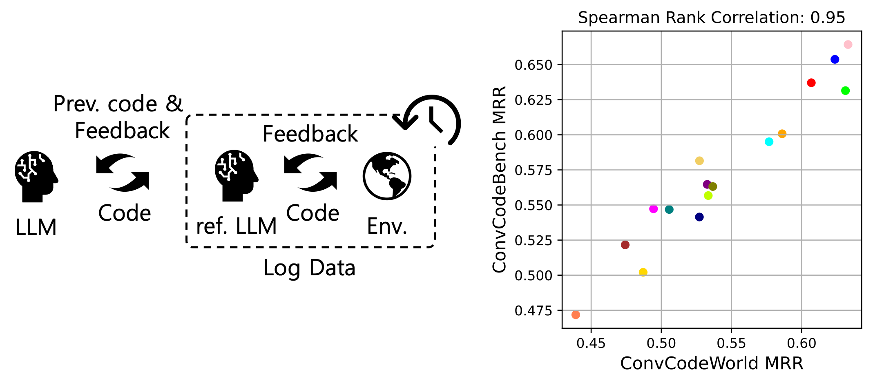

# ConvCodeWorld & ConvCodeBench
<center>

</center>

<p align="center">

[//]: # (    <a href="https://huggingface.co/spaces/bigcode/bigcodebench-leaderboard"></a>)

[//]: # (    <a href="https://arxiv.org/abs/2406.15877"></a>)

[//]: # (    <a href="https://pypi.org/project/bigcodebench/"></a>)
[//]: # (    <a href="https://github.com/bigcodebench/bigcodebench/blob/master/LICENSE"></a>)
</p>

<p align="center">
    <a href="#-about">🎙️About</a> •
    <a href="#-quick-start">🔥Quick Start</a> •
    <a href="#-full-script">🚀Full Script</a> •
    <a href="#-result-analysis">📊Result Analysis</a> •
    <a href="#-llm-generated-code">💻LLM-generated Code</a> •
    <a href="#-known-issues">🐞Known Issues</a> •
    <a href="#-citation">📜Citation</a> •
    <a href="#-acknowledgement">🙏Acknowledgement</a>
</p>

## News
- **[2024-09-10]** We release ConvCodeWorld, reproducible environments with diverse feedback combination for conversational code generation, and ConvCodeBench, a cost-effective benchmark strongly correlates to ConvCodeWorld.

[//]: # (Preprint is available [here]&#40;&#41;. PyPI package is available [here]&#40;&#41; with the version `0.3.6`.&#40;&#41;)
## 🎙️ About


<p align="center">

<br>

</p>


ConvCodeWorld provides novel, reproducible environments designed to assess the multi-turn code generation capabilities of LLMs. 
This environment incorporates a comprehensive categorization of feedback types that reflect diverse real-world programming scenarios. 

### Available Feedback Types

<p align="center">

</p>


- **Compilation Feedback** indicates whether the code compiles successfully or provides error messages.
- **Execution Feedback**  assesses the code's runtime behavior, further divided into:
  - **Low Test Coverage**: feedback based on a limited set of test cases
  - **High Test Coverage**: comprehensive feedback covering all test cases, including edge cases
- **Simulated User Feedback**: To ensure a controllable & reproducible feedback, we employ GPT-4o to simulate user feedback, categorized by expertise:
  - **Novice User Feedback** simulates interactions with users who can identify issues but may not know how to fix them.
  - **Expert User Feedback** represents guidance from experienced programmers who can provide specific suggestions for code improvement. 


---
<p align="center">

<br>

</p>


ConvCodeBench is a cost-effective benchmark that strongly correlates to ConvCodeWorld.
ConvCodeBench uses logs from ConvCodeWorld generated by a reference LLM (DeepSeekCoder-6.7B-Instruct) alongside corresponding simulated user feedback, to assess the target LLMs' ability to refine code at each turn, while keeping the previous interactions frozen. 
ConvCodeBench is more cost-effective, efficient, and reproducible, as it eliminates the need to re-generate user feedback at each turn. 

[//]: # (### ConvCodeBench is the Best Suite for...)

[//]: # (- ✨Cost-effective )

[//]: # (- )


## 🔥 Quick Start

To get started, please first set up the environments:

### Install MiniConda
```bash
wget https://repo.anaconda.com/miniconda/Miniconda3-latest-Linux-x86_64.sh
chmod +x Miniconda3-latest-Linux-x86_64.sh
bash Miniconda3-latest-Linux-x86_64.sh -b
export PATH="/home/$USERNAME/miniconda3/bin:$PATH"
conda install conda-forge::conda-ecosystem-user-package-isolation
# Restart the kernel
```

### Setup Conda Environments
All you need to do is run `setup.sh` 😊.
```bash
bash setup.sh
```
This script will create three environments:
- `ConvCodeWorld`: The main environment for ConvCode[World|Bench] 
- `bigcodebench`: [BigCodeBench](https://github.com/bigcode-project/bigcodebench) for initial code generation and code execution
- `vllm`: [vLLM](https://github.com/vllm-project/vllm) to accelerate inference speed of open-source LLMs

### OpenAI API Key 
Please save your API key in `convcodeworld` folder (where `run.py` is placed).
```bash
cd convcodeworld
echo $OPENAI_API_KEY > .api_key
```
This is necessary if 1) you run on ConvCodeWorld, or 2) you want to use OpenAI models for code generation.  

### Run vLLM 
If you want to use open-source models for code generation, you need to run: 
```bash
bash run_vllm.sh $MODEL_NAME
# Now open another kernel and run ConvCode[World|Bench]!  
```
Note that `$MODEL_NAME` is a full huggingface name such as `deepseek-ai/deepseek-coder-6.7b-instruct`. 
The default setting is to use `bfloat16` and to occupy a single GPU.
If you want to use quantization, you can simply include `--quantization="fp8"` in `run_vllm.sh`.
Similarly, if you want to use `n` gpus, you can include: `--tensor-parallel-size n`.


## 🚀 Full Script

### ConvCodeWorld
 To run ConvCodeWorld, we provide a sample script for the full pipeline: 
```bash
bash run_convcodeworld.sh $MODEL_NAME $EXECUTION_FEEDBACK $PARTIAL_TEST $SIMULATED_USER_FEEDBACK $USER_EXPERTISE
```
- `MODEL_NAME`: A full huggingface name such as `deepseek-ai/deepseek-coder-6.7b-instruct`.  
- `EXECUTION_FEEDBACK` (`true` or `false`): `true` if employ execution feedback. 
- `PARTIAL_TEST` (`true`, `false`, or `none`): `true` if test coverage is low (using only public test cases). `none` if `EXECUTION_FEEDBACK` is `false`. 
- `SIMULATED_USER_FEEDBACK` (`true` or `false`): `true` if employ user feedback simulation by GPT-4o. 
- `USER_EXPERTISE` (`novice`, `expert`, or `none`): User expertise for simulated user feedback. `none` if `SIMULATED_USER_FEEDBACK` is `false`. 

Note that compilation feedback is always included.

#### Example
If you want to run `deepseek-ai/deepseek-coder-6.7b-instruct` while feeding execution feedback with high test coverage and novice-level user feedback:
```bash
bash run_convcodeworld.sh deepseek-ai/deepseek-coder-6.7b-instruct true false true novice
```
 

### ConvCodeBench
To run ConvCodeBench, we also provide a sample script as follows: 

```bash
bash run_convcodebench.sh $MODEL_NAME $EXECUTION_FEEDBACK $PARTIAL_TEST $SIMULATED_USER_FEEDBACK $USER_EXPERTISE $REF_MODEL_NAME
```
- `MODEL_NAME`: A full huggingface name such as `deepseek-ai/deepseek-coder-6.7b-instruct`.  
- `EXECUTION_FEEDBACK` (`true` or `false`): `true` if employ execution feedback. 
- `PARTIAL_TEST` (`true`, `false`, or `none`): `true` if test coverage is low (using only public test cases). `none` if `EXECUTION_FEEDBACK` is `false`. 
- `SIMULATED_USER_FEEDBACK` (`true` or `false`): `true` if employ user feedback simulation by GPT-4o. 
- `USER_EXPERTISE` (`novice`, `expert`, or `none`): User expertise for simulated user feedback. `none` if `SIMULATED_USER_FEEDBACK` is `false`. 
- `REF_MODEL_NAME`: The reference model name. We recommend `deepseek-ai/deepseek-coder-6.7b-instruct`.  


## 📊 Evaluation

We provide a script to replicate the MRR and Recall results.

### ConvCodeWorld
To print the ConvCodeWorld results: 
```bash
python print_results.py --option live --model_name $MODEL_NAME --save_dir $SAVE_DIR
```
- `MODEL_NAME`: A full huggingface name such as `deepseek-ai/deepseek-coder-6.7b-instruct`.  
- `SAVE_DIR`: A directory path where the results are stored. Default is `results`.


#### Evaluation Example
```
$ python print_results.py --option live --model_name deepseek-ai/deepseek-coder-6.7b-instruct

+------+------------------------+---------------------+-------------------------------------+----------------------------------+--------------------+-------------------------------------+----------------------------------+
| Turn | w/ CF EF (partial TCs) | w/ CF EF (full TCs) | w/ CF EF (partial TCs) SNF (gpt-4o) | w/ CF EF (full TCs) SNF (gpt-4o) | w/ CF SEF (gpt-4o) | w/ CF EF (partial TCs) SEF (gpt-4o) | w/ CF EF (full TCs) SEF (gpt-4o) |
+------+------------------------+---------------------+-------------------------------------+----------------------------------+--------------------+-------------------------------------+----------------------------------+
|  0   |          35.2          |         35.2        |                 35.2                |               35.2               |        35.2        |                 35.2                |               35.2               |
|  1   |          36.9          |         36.5        |                 41.1                |               42.8               |        60.0        |                 60.0                |               61.8               |
|  2   |          37.0          |         36.8        |                 42.4                |               45.7               |        68.4        |                 69.0                |               70.8               |
|  3   |          37.2          |         37.1        |                 42.8                |               46.8               |        74.4        |                 73.8                |               76.0               |
|  4   |          37.4          |         37.1        |                 42.9                |               46.9               |        77.5        |                 77.2                |               78.3               |
|  5   |          37.4          |         37.1        |                 42.9                |               47.6               |        79.0        |                 79.0                |               79.9               |
|  6   |          37.5          |         37.3        |                 42.8                |               47.6               |        80.7        |                 80.3                |               80.8               |
|  7   |          37.5          |         37.3        |                 43.0                |               47.7               |        81.7        |                 80.7                |               81.6               |
|  8   |          37.4          |         37.1        |                 42.8                |               47.8               |        82.2        |                 81.2                |               82.1               |
|  9   |          37.4          |         37.2        |                 42.9                |               47.6               |        82.5        |                 81.7                |               82.3               |
|  10  |          37.4          |         37.1        |                 42.9                |               47.7               |        82.7        |                 82.3                |               83.0               |
+------+------------------------+---------------------+-------------------------------------+----------------------------------+--------------------+-------------------------------------+----------------------------------+
Table 1. Pass@1 results of deepseek-ai/deepseek-coder-6.7b-instruct on ConvCodeWorld for each turn.
 - CF: Compilation Feedback
 - EF: Execution Feedback
 - partial|full TCs: Test Cases with partial|full test coverage 
 - SNF: Simulated Novice Feedback
 - SEF: Simulated Expert Feedback

+---------+------------------------+---------------------+-------------------------------------+----------------------------------+--------------------+-------------------------------------+----------------------------------+
| Metrics | w/ CF EF (partial TCs) | w/ CF EF (full TCs) | w/ CF EF (partial TCs) SNF (gpt-4o) | w/ CF EF (full TCs) SNF (gpt-4o) | w/ CF SEF (gpt-4o) | w/ CF EF (partial TCs) SEF (gpt-4o) | w/ CF EF (full TCs) SEF (gpt-4o) |
+---------+------------------------+---------------------+-------------------------------------+----------------------------------+--------------------+-------------------------------------+----------------------------------+
|   MRR   |          36.2          |         36.1        |                 38.8                |               40.5               |        53.3        |                 53.2                |               53.9               |
|  Recall |          37.7          |         37.5        |                 43.3                |               48.2               |        82.8        |                 82.5                |               83.1               |
+---------+------------------------+---------------------+-------------------------------------+----------------------------------+--------------------+-------------------------------------+----------------------------------+
Table 2. MRR and Recall results of deepseek-ai/deepseek-coder-6.7b-instruct on ConvCodeWorld.

```

### ConvCodeBench
To print the ConvCodeBench results: 
```bash
python print_results.py --option static --model_name $MODEL_NAME --ref_model_name $REF_MODEL_NAME --save_dir $SAVE_DIR
```
- `MODEL_NAME`: A full huggingface name such as `SenseLLM/ReflectionCoder-DS-33B`.  
- `REF_MODEL_NAME`: A full huggingface name of the reference model such as `deepseek-ai/deepseek-coder-6.7b-instruct`.  
- `SAVE_DIR`: A directory path where the results are stored. Default is `results`.

#### Evaluation Example
```
$ python print_results.py --option static --model_name SenseLLM/ReflectionCoder-DS-33B --ref_model_name deepseek-ai/deepseek-coder-6.7b-instruct 
+------+-------------------------------------+----------------------------------+--------------------+-------------------------------------+----------------------------------+
| Turn | w/ CF EF (partial TCs) SNF (gpt-4o) | w/ CF EF (full TCs) SNF (gpt-4o) | w/ CF SEF (gpt-4o) | w/ CF EF (partial TCs) SEF (gpt-4o) | w/ CF EF (full TCs) SEF (gpt-4o) |
+------+-------------------------------------+----------------------------------+--------------------+-------------------------------------+----------------------------------+
|  1   |                 41.8                |               45.2               |        35.2        |                 60.7                |               62.6               |
|  2   |                 44.3                |               47.5               |        60.2        |                 72.6                |               72.9               |
|  3   |                 44.1                |               48.8               |        74.5        |                 75.9                |               77.5               |
|  4   |                 44.8                |               49.4               |        78.8        |                 79.0                |               80.4               |
|  5   |                 44.6                |               49.8               |        80.3        |                 80.9                |               82.0               |
|  6   |                 44.6                |               50.3               |        81.7        |                 82.1                |               83.0               |
|  7   |                 44.8                |               50.3               |        82.7        |                 83.1                |               83.4               |
|  8   |                 44.8                |               50.6               |        83.3        |                 83.2                |               83.9               |
|  9   |                 44.6                |               50.3               |        83.2        |                 83.9                |               84.0               |
|  10  |                 44.8                |               50.6               |        83.8        |                 84.4                |               84.6               |
+------+-------------------------------------+----------------------------------+--------------------+-------------------------------------+----------------------------------+
Table 1. Pass@1 results of SenseLLM/ReflectionCoder-DS-33B on ConvCodeBench for each turn (ref. model: deepseek-ai/deepseek-coder-6.7b-instruct).
 - CF: Compilation Feedback
 - EF: Execution Feedback
 - partial|full TCs: Test Cases with partial|full test coverage 
 - SNF: Simulated Novice Feedback
 - SEF: Simulated Expert Feedback

+---------+-------------------------------------+----------------------------------+--------------------+-------------------------------------+----------------------------------+
| Metrics | w/ CF EF (partial TCs) SNF (gpt-4o) | w/ CF EF (full TCs) SNF (gpt-4o) | w/ CF SEF (gpt-4o) | w/ CF EF (partial TCs) SEF (gpt-4o) | w/ CF EF (full TCs) SEF (gpt-4o) |
+---------+-------------------------------------+----------------------------------+--------------------+-------------------------------------+----------------------------------+
|   MRR   |                 52.6                |               54.7               |        62.6        |                 64.5                |               65.3               |
|  Recall |                 56.4                |               62.0               |        85.9        |                 87.8                |               88.2               |
+---------+-------------------------------------+----------------------------------+--------------------+-------------------------------------+----------------------------------+
Table 2. MRR and Recall results of SenseLLM/ReflectionCoder-DS-33B on ConvCodeBench (ref. model: deepseek-ai/deepseek-coder-6.7b-instruct).

```


## 💻 LLM-generated Code

We share pre-generated code samples from LLMs we have [evaluated]().

## 🐞 Known Issues
-  [Due to the flakiness in the evaluation](https://github.com/bigcode-project/bigcodebench?tab=readme-ov-file#-known-issues), the execution results may vary slightly (~0.2% for Full set, and ~0.6% for Hard set) between runs. 

## 📜 Citation

```bibtex

```

## 🙏 Acknowledgement

- [BigCodeBench](https://github.com/bigcode-project/bigcodebench)
- [DSPy](https://github.com/stanfordnlp/dspy)
- [vLLM](https://github.com/vllm-project/vllm)